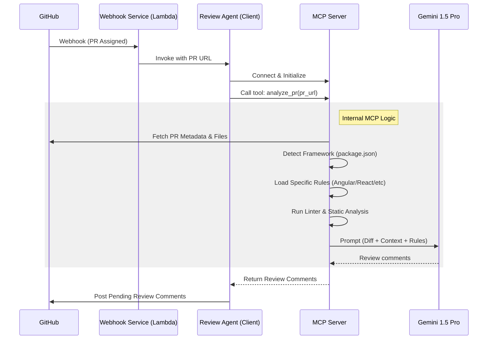

# AI Code Review Bot which runs locally

A dual-mode AI agent that reviews Pull Requests. It can run as a background Webhook Service (AWS Lambda) or be tested locally via CLI.

## Prerequisites

*   Node.js v20+
*   NPM
*   AWS CLI & CDK (if deploying to AWS)

## 1. Installation

Install dependencies for the monorepo:

```bash
npm install
```

## 2. Configuration

1.  Copy the example environment file in the MCP server package:
    ```bash
    cp .env.example packages/mcp-server/.env
    ```
2.  Edit `packages/mcp-server/.env` and add your keys:
    ```env
    OPENAI_API_KEY=your_openai_key_here
    # GITHUB_WEBHOOK_SECRET is only needed for the Webhook Service (AWS), not local testing.
    ```

## 3. Running Locally (Test Mode)

You can trigger a full "Mock Review" from your terminal. This will:
1.  Mock a GitHub PR payload (Angular or React based on the URL).
2.  Run the Framework Detector.
3.  Send the code + rules to Gemini.
4.  Print the AI's review comments to the console.

**Run the local test:**

```bash
cd packages/mcp-server
npm run test:local
```

You will be prompted to enter a GitHub PR URL (e.g., `https://github.com/owner/repo/pull/123`).
Alternatively, pass it as an argument:

```bash
npm run test:local -- "https://github.com/owner/repo/pull/123"
```

**Note**: You should set `GITHUB_TOKEN` in `.env` to avoid rate limits and access private repos.

## 4. Architecture

### System Flow


*   **`packages/mcp-server`**: Core Logic. Contains the Framework Detection strategies (`src/strategies`) and the Gemini integration.
*   **`packages/webhook-service`**: AWS Lambda handler. Verifies GitHub signatures and invokes the agent.
*   **`packages/aws-infra`**: CDK code to deploy the stack.

## 5. Deployment (Optional)

To deploy to AWS:

1.  Bootstrap CDK (one time): `npx cdk bootstrap`
2.  Deploy the stack:
    ```bash
    cd packages/aws-infra
    npm run deploy
    ```
